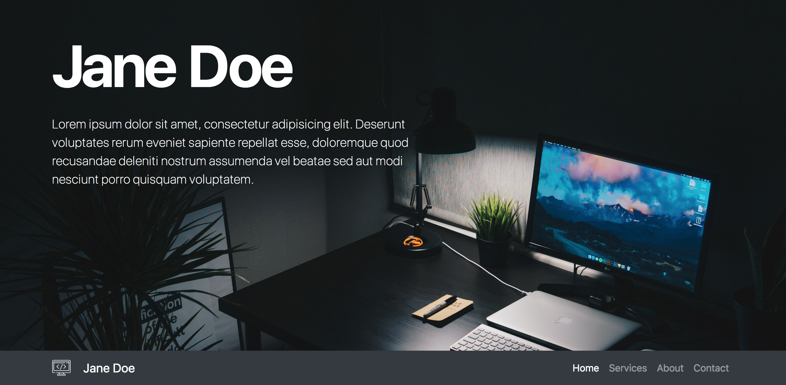
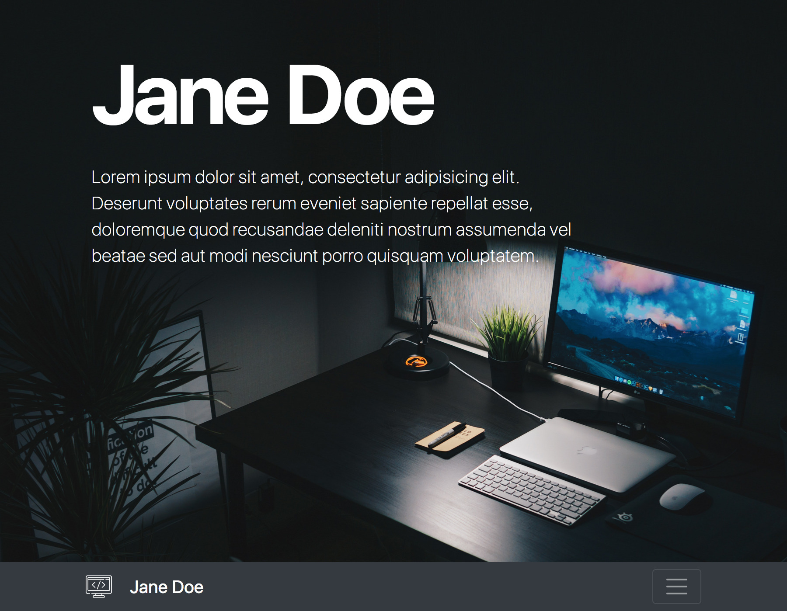
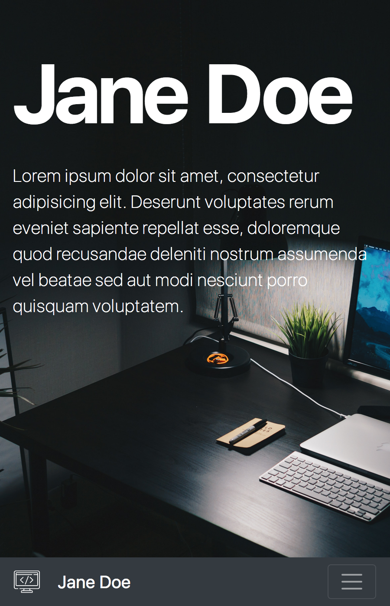

# Big Picture Portfolio

Let's create a portfolio website with Bootstrap! The only custom CSS you might need is for the big image.

Take a look at the examples:

Desktop:

Tablet:

Mobile:

## Extra:

- What else can you add to optimize this site for seach engines?
- The image included in the `images` folder is quite big - how can you improve this?
- Can you deploy this site to Github Pages? If you do, add the link to repo description.

## Credits:

Icons made by <a href="https://www.flaticon.com/authors/freepik" title="Freepik">Freepik</a> from <a href="https://www.flaticon.com/" title="Flaticon"> www.flaticon.com</a>